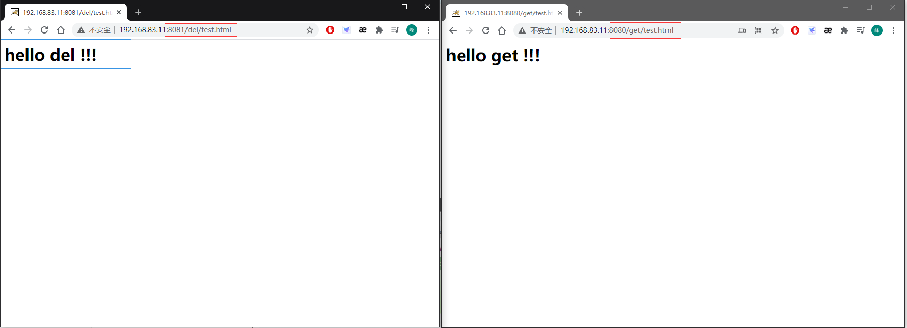

# Nginx

## 一、linux上的安装和启动

> 使用的是centos7，nginx版本为1.16.1

1.在[官网](http://nginx.org/en/download.html)下载合适版本的nginx压缩包放入linux中。

2.安装Nginx依赖`yum -y install gcc zlib zlib-devel pcre-devel openssl openssl-devel`。

3.解压nginx压缩包，并进入压缩后的nginx目录。

4.执行`./configure`和`make && make install`

此时nginx已经安装成功。并且安装的目录为`/usr/local/nginx`。


启动nginx：进入`/usr/local/nginx/sbin`目录执行`./nginx`启动nginx，在浏览器中输入ip地址加上:80(nginx默认端口为80)访问页面。


## 二、常用操作命令

首先配置环境变量，因为不配置环境变量的话必须得在`usr/local/nginx/sbin`目录下执行命令。

```shell
[root@localhost sbin] vim /etc/profile
#在文件末尾处添加以下两段代码保存并退出。
NGINX_HOME=/usr/local/nginx
[root@localhost sbin] export PATH=${NGINX_HOME}/sbin:${PATH}
[root@localhost sbin] source /etc/profile
```

### 2.1 查看nginx版本

`nginx -v`


### 2.2 关闭nginx

`nginx -s stop`


### 2.3 启动nginx

`nginx`


### 2.4 重启nginx

`nginx -s reload`

### 2.5 帮助命令

`nginx -h`


## 三、配置文件

nginx配置的文件的位置：`/usr/local/nginx/conf/nginx.conf`


nginx的配置文件可分为三大块：全局块、events块、http块。

### 3.1 全局块

从配置文件开始到 events 块之间的内容，**主要会设置一些影响 Nginx 服务器整体运行的配置指令**，主要包括

1. 配置运行 Nginx 服务器的用户（组）、
2. 允许生成的 worker process 数，
3. 进程 PID 存放路径、
4. 日志存放路径和类型
5. 配置文件的引入

比如上面第一行配置的：

```shell
worker_processes  1;
```

这是Nginx服务器并发处理服务的关键配置，worker_processes 值越大，可以支持的并发处理量也越多，但是会受到硬件、软件等设备的制约。

### 3.2 events块

events块涉及的指令主要影响nginx服务器与用户的网络连接。常用的设置包括是否开启对多 work process 下的网络连接进行序列化，是否允许同时接收多个网络连接，选取哪种事件驱动模型来处理连接请求，每个 work process 可以同时支持的最大连接数等。

```shell
events {
    worker_connections  1024;
}
```

上述例子就表示每个 work process 支持的最大连接数为 1024。这部分的配置对 Nginx 的性能影响较大，在实际中应该灵活配置。

### 3.3 http块

这算是 Nginx 服务器配置中最频繁的部分，代理、缓存和日志定义等绝大多数功能和第三方模块的配置都在这里。需要注意的是： http 块也可以包括:

1. http 全局块、
2. server 块。

#### 3.3.1 http 全局块

http 全局块配置的指令包括文件引入、 MIME-TYPE 定义、日志自定义、连接超时时间、单链接请求数上限等

#### 3.3.2 server 块

这块和虚拟主机有密切关系，虚拟主机从用户角度看，和单一独立的硬件主机是完全一样的，该技术的产生是为了节省互联网服务器硬件成本。

每个 http 块可以包括多个 server 块，而**每个 server 块就相当于一个虚拟主机**。

而每个 server 块也分为：

1. 全局 server 块，
2. 多个 locaton 块。

##### 3.3.2.1 全局 server 块

最常见的配置是本虚拟机主机的监听配置和本虚拟主机的名称或 IP 配置。

##### 3.3.2.2 location 块

一个 server 块可以配置多个 location 块。

这块的主要作用是基于 Nginx 服务器接收到的请求字符串（例如 server_name/uri-string），对虚拟主机名称（也可以是 IP 别名）之外的字符串（例如 前面的 /uri-string）进行匹配，对特定的请求进行处理。

地址定向、数据缓存和应答控制等功能，还有许多第三方模块的配置也在这里进行。

## 四、反向代理

### 4.1 两种代理方式

#### 正向代理

需要在客户端配置代理服务器进行指定网站访问


#### 反向代理

其实客户端对代理是无感知的，因为客户端不需要任何配置就可以访问，我们只需要将请求发送到反向代理服务器，由反向代理服务器去选择目标服务器获取数据后，在返回给客户端，此时反向代理服务器和目标服务器对外就是一个服务器，暴露的是代理服务器地址，隐藏了真实服务器 IP 地址。


### 4.2 基础配置

#### 4.2.1 准备工作

首先安装好jdk和tomcat，安装过程就省略了，这里我安装的是jdk1.8和tomcat8，具体版本如下图所示。


开放防火墙端口，启动tomcat。

```shell
[root@localhost tomcat8080] firewall-cmd --add-port=8080/tcp --permanent
[root@localhost tomcat8080] firewall-cmd --reload
[root@localhost tomcat8080] ./bin/startup.sh
```


#### 4.2.2 修改host文件

找到windows下的hosts文件。


做如下修改：


#### 4.2.3 修改nginx配置

来到linux中修改nginx配置


重启nginx服务

#### 4.2.4 测试

在浏览器中访问123.com。


### 4.3 实际案例

> 访问http://192.168.83.11:9001/get/跳转至127.0.0.1:8080
>
> 访问http://192.168.83.11:9001/del/跳转至127.0.0.1:8081

实现步骤：

1. 准备两个tomcat，分别设置访问端口为8080和8081。启动两个tomcat，通过浏览器访问测试其是否启动成功。

   

2. 分别在两个tomcat目录中的webapps目录下创建get目录和del目录，在两个目录中放入一个静态页面。通过浏览器查看两个服务器中的页面。



3. 修改nginx.conf文件。

   

   访问网页。

   

**location的用法：**

1. = :用于不含正则表达式的uri前，要求请求字符串与uri严格匹配，如果匹配成功，就停止继续向下搜索并立即处理该请求。
2. ~:用于表示 uri包含正则表达式，并且区分大小写。
3. ~*:用于表示 uri包含正则表达式，并且不区分大小写。
4. ^~:用于不含正则表达式的uri前，要求Nginx服务器找到标识 uri和请求字符串匹配度最高的 location后，立即使用此 location处理请求，而不再使用location块中的正则uri和请求字符串做匹配。
5. 如果uri包含正则表达式，则必须要有~或者~*标识。

## 五、负载均衡

### 5.1 负载均衡简介

客户端发送多个请求到服务器，服务器处理请求，有一些可能要与数据库进行交互，服务器处理完毕后，再将结果返回给客户端。

这种架构模式对于早期的系统相对单一，并发请求相对较少的情况下是比较适合的，成本也低。**但是随着信息数量的不断增长，访问量和数据量的飞速增长，以及系统业务的复杂度增加，这种架构会造成服务器相应客户端的请求日益缓慢，并发量特别大的时候，还容易造成服务器直接崩溃**。很明显这是由于服务器性能的瓶颈造成的问题，那么如何解决这种情况呢？

我们首先想到的可能是**升级服务器的配置**，比如提高 CPU 执行频率，加大内存等提高机器的物理性能来解决此问题，但是我们知道摩尔定律的日益失效，硬件的性能提升已经不能满足日益提升的需求了。最明显的一个例子，天猫双十一当天，某个热销商品的瞬时访问量是极其庞大的，那么类似上面的系统架构，将机器都增加到现有的顶级物理配置，都是不能够满足需求的。那么怎么办呢？

上面的分析我们去掉了增加服务器物理配置来解决问题的办法，也就是说纵向解决问题的办法行不通了，那么横向增加服务器的数量呢？这时候**集群**的概念产生了，单个服务器解决不了，我们增加服务器的数量，然后**将请求分发到各个服务器上，将原先请求集中到单个服务器上的情况改为将请求分发到多个服务器上，将负载分发到不同的服务器**，也就是我们所说的**负载均衡**


### 5.2 简单实现

1. 同样准备两个tomcat，在两个tomcat下的webapps中放入内容不同的test.html文件。启动tomcat，在浏览器中分别输入网址查看效果。

   

2. 修改nginx.conf的配置文件，在http{}中添加以下内容。

   

### 5.3 负载均衡算法

#### 轮询

这是Ngnix负载均衡默认分配策略。每个请求按时间顺序逐一分配到不同的后端服务器，如果后端服务器 down 掉，能自动剔除。

#### 加权

weight 代表权，重默认为 1，权重越高被分配的客户端越多。指定轮询几率，weight和访问比率成正比，用于后端服务器性能不均的情况。例如：

```
upstream myserver{
	server 127.0.0.1:8081 weight=8;
	server 127.0.0.1:8082 weight=2;
}
```

#### ip_hash

每个请求按访问 ip 的 hash 结果分配，这样每个访客固定访问一个后端服务器，可以解决 session 的问题。 例如：

```
upstream myserver{
	ip_hash;
	server 127.0.0.1:8081;
	server 127.0.0.1:8082;
}
```

#### fair

这是Ngnix负载均衡第三方分配策略。按后端服务器的响应时间来分配请求，响应时间短的优先分配。

```
upstream myserver{
	server 127.0.0.1:8081;
	server 127.0.0.1:8082;
	fair;
}
```

可能需要额外安装，否则就抛出异常`[emerg] 7032#7120: unknown directive "fair" in C:\nginx-1.18.0/conf/nginx.conf:38`。

## 六、动静分离

### 6.1 简介

**Nginx 动静分离简单来说就是把动态跟静态请求分开，不能理解成只是单纯的把动态页面和静态页面物理分离**。严格意义上说应该是动态请求跟静态请求分开，可以理解成使用 Nginx 处理静态页面， Tomcat 处理动态页面。动静分离从目前实现角度来讲大致分为两种：

1. 一种是纯粹把静态文件独立成单独的域名，放在独立的服务器上，也是目前主流推崇的方案；
2. 另外一种方法就是动态跟静态文件混合在一起发布，通过 nginx 来分开。

通过 location 指定不同的后缀名实现不同的请求转发。通过 expires 参数设置，可以使浏览器缓存过期时间，减少与服务器之前的请求和流量。具体 Expires 定义：是给一个资源设定一个过期时间，也就是说无需去服务端验证，直接通过浏览器自身确认是否过期即可，所以不会产生额外的流量。**此种方法非常适合不经常变动的资源**。（如果经常更新的文件，不建议使用 Expires 来缓存）

若将其设置 3d，表示在这 3 天之内访问这个 URL，发送一个请求，比对服务器该文件最后更新时间没有变化，则不会从服务器抓取，返回状态码304，如果有修改，则直接从服务器重新下载，返回状态码 200。

### 6.2 实现步骤

1. 在根目录下创建一个static_file的目录用于存放静态资源。

   

2. 修改nginx配置文件

   

3. 测试

   

## 七、高可用

只有一个nginx服务器时当nginx宕机，tomcat服务器就无法运行了，因此需要两台nginx实现nginx的高可用。

1. 准备两台虚拟机IP地址分别为：192.168.83.11和192.168.83.12，都安装nginx。


2. 在两台虚拟机上安装keepalive

```shell
#安装命令
yum install keepalived -y
```


安装成功后会在etc目录下生成一个keepalived目录，在这个目录中有keepalived配置文件。


3. 主服务器192.168.83.11的配置

修改keepalived配置文件

```shell
global_defs {
	notification_email {
		acassen@firewall.loc
		failover@firewall.loc
		sysadmin@firewall.loc
	}
	notification_email_from Alexandre.Cassen@firewall.loc
	smtp_server 192.168.83.11
	smtp_connect_timeout 30
	router_id LVS_DEVEL
}

vrrp_script chk_http_port {
	script "/usr/local/src/nginx_check.sh"
	interval 2 #（检测脚本执行的间隔）
	weight 2
}

vrrp_instance VI_1 {
	state MASTER # 备份服务器上将 MASTER 改为 BACKUP
	interface ens33 //网卡名
	virtual_router_id 51 # 主、备机的 virtual_router_id 必须相同
	priority 100 # 主、备机取不同的优先级，主机值较大，备份机值较小
	advert_int 1
	authentication {
		auth_type PASS
		auth_pass 1111
	}
	virtual_ipaddress {
		192.168.83.83 // VRRP H 虚拟地址
	}
}
```

在/usr/local/src/目录下新建一个nginx_check.sh文件并在文件中写入以下内容。

```shell
#!/bin/bash
A=`ps -C nginx – no-header |wc -l`
if [ $A -eq 0 ];then
	/usr/local/nginx/sbin/nginx
	sleep 2
	if [ `ps -C nginx --no-header |wc -l` -eq 0 ];then
		killall keepalived
	fi
fi
```

4. 修改从服务器192.168.83.12的配置。

修改keepalived配置文件

```shell
global_defs {
	notification_email {
		acassen@firewall.loc
		failover@firewall.loc
		sysadmin@firewall.loc
	}
	notification_email_from Alexandre.Cassen@firewall.loc
	smtp_server 192.168.83.11
	smtp_connect_timeout 30
	router_id LVS_DEVEL
}

vrrp_script chk_http_port {
	script "/usr/local/src/nginx_check.sh"
	interval 2 #（检测脚本执行的间隔）
	weight 2
}

vrrp_instance VI_1 {
	state BACKUP # 备份服务器上将 MASTER 改为 BACKUP
	interface ens33 //网卡名
	virtual_router_id 51 # 主、备机的 virtual_router_id 必须相同
	priority 90 # 主、备机取不同的优先级，主机值较大，备份机值较小
	advert_int 1
	authentication {
		auth_type PASS
		auth_pass 1111
	}
	virtual_ipaddress {
		192.168.83.83 // VRRP H 虚拟地址
	}
}
```

在/usr/local/src/目录下新建一个nginx_check.sh文件并在文件中写入以下内容。

```shell
#!/bin/bash
A=`ps -C nginx – no-header |wc -l`
if [ $A -eq 0 ];then
	/usr/local/nginx/sbin/nginx
	sleep 2
	if [ `ps -C nginx --no-header |wc -l` -eq 0 ];then
		killall keepalived
	fi
fi
```

5. 启动主服务器和从服务器的nginx和keepalived

   ```shell
   nginx
   systemctl start keepalived.service
   ```

6. 测试效果

   首先通过虚拟ip地址（192.168.83.83）访问网页。

   

   停止主服务器的nginx和keepalived，再次访问网页。

   ```shell
   [root@nginx_11 ~]# nginx -s stop
   [root@nginx_11 ~]# ps aux | grep nginx
   avahi       717  0.0  0.1  62272  2068 ?        Ss   13:23   0:00 avahi-daemon: running [nginx11.local]
   root       2784  0.0  0.0 112828   984 pts/0    S+   14:10   0:00 grep --color=auto nginx
   [root@nginx_11 ~]# systemctl stop keepalived.service 
   [root@nginx_11 ~]# ps aux | grep keepalived
   root       2813  0.0  0.0 112824   988 pts/0    S+   14:10   0:00 grep --color=auto keepalived
   [root@nginx_11 ~]# 
   ```

   

   

