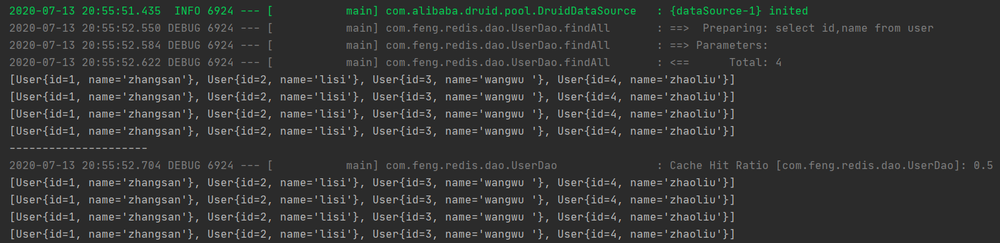

####什么是缓存
定义：计算机内存中的一段数据
####内存中数据的特点
* 读写快
* 断电立即丢失
####缓存解决了什么问题？
* 提高网站吞吐量，提高网站运行效率
* 减轻数据库访问压力
####使用缓存的情景
数据库中极少发生修改的数据建议使用缓存
####本地缓存和分布式缓存的区别
本地缓存：存在应用服务器内存中数据称为本地缓存
分布式缓存：存储在当前应用服务器内存之外数据称之为分布式缓存
####利用mybatis自身本地缓存结合redis实现分布式缓存
#####mybatis的二级缓存
编写测试方法：
```java
List<User> findall = userService.findall();
findall.forEach(user -> System.out.println(findall));
System.out.println("---------------------");
List<User> findall2 = userService.findall();
findall2.forEach(user -> System.out.println(findall2));
```       
开启mybatis的二级缓存前：

开启mybatis的二级缓存后：

#####自定义Rediscache的实现
通过mybatis默认cache源码得知，可以使用自定义Cache类实现Cache接口并对里面的方法进行实现

第一种方式：单表缓存

第一步：
编写一个工具类ApplicationContextUtils，用于获取工厂中的类
```java
@Component
public class ApplicationContextUtils implements ApplicationContextAware {
    //保留下来的工厂
    private static ApplicationContext applicationContext;
    /**
     * 将创建好的工厂以参数的形式传递给这个类
     */
    @Override
    public void setApplicationContext(ApplicationContext applicationContext) throws BeansException {
        this.applicationContext = applicationContext;
    }
    /**
     * 提供在工厂中获取对象的方法
     */
    public static Object getBean(String beanName){
        return applicationContext.getBean(beanName);
    }
}
```
第二步：
编写Cache的实现类
```java
public class RedisCache implements Cache {
    /**
     *  结果：id-----------------------------------------com.feng.redis.dao.UserDao
     *  结论：当前放入缓存的mapper的namespace
     */
    private final String id;
    //必须存在构造函数
    public RedisCache(String id) {
        System.out.println("id-----------------------------------------"+id);
        this.id = id;
    }
    //返回cache的唯一标识
    @Override
    public String getId() {
        return this.id;
    }
    //缓存中放入值
    @Override
    public void putObject(Object key, Object value) {
        System.out.println("key:"+key.toString());
        System.out.println("value:"+value.toString());
        RedisTemplate redisTemplate = (RedisTemplate) ApplicationContextUtils.getBean("redisTemplate");
        redisTemplate.setKeySerializer(new StringRedisSerializer());
        redisTemplate.setHashKeySerializer(new StringRedisSerializer());
        //使用redis中的hash类型作为缓存模型
        redisTemplate.opsForHash().put(id.toString(),key.toString(),value );
    }
    //缓存中获取值
    @Override
    public Object getObject(Object key) {
        RedisTemplate redisTemplate = (RedisTemplate) ApplicationContextUtils.getBean("redisTemplate");
        redisTemplate.setKeySerializer(new StringRedisSerializer());
        redisTemplate.setHashKeySerializer(new StringRedisSerializer());
        return redisTemplate.opsForHash().get(id.toString(),key.toString());
    }

    @Override
    public Object removeObject(Object key) {
        return null;
    }

    @Override
    public void clear() {

    }

    @Override
    public int getSize() {
        return 0;
    }
}
```
第三步：
测试，测试结果：
```
key:967481057:3911802963:com.feng.redis.dao.UserDao.findAll:0:2147483647:select id,name from user:SqlSessionFactoryBean
value:[User{id=1, name='zhangsan'}, User{id=2, name='lisi'}, User{id=3, name='wangwu '}, User{id=4, name='zhaoliu'}]
[User{id=1, name='zhangsan'}, User{id=2, name='lisi'}, User{id=3, name='wangwu '}, User{id=4, name='zhaoliu'}]
[User{id=1, name='zhangsan'}, User{id=2, name='lisi'}, User{id=3, name='wangwu '}, User{id=4, name='zhaoliu'}]
[User{id=1, name='zhangsan'}, User{id=2, name='lisi'}, User{id=3, name='wangwu '}, User{id=4, name='zhaoliu'}]
[User{id=1, name='zhangsan'}, User{id=2, name='lisi'}, User{id=3, name='wangwu '}, User{id=4, name='zhaoliu'}]
---------------------
2020-07-13 22:23:27.269 DEBUG 6328 --- [           main] com.feng.redis.dao.UserDao               : Cache Hit Ratio [com.feng.redis.dao.UserDao]: 0.5
[User{id=1, name='zhangsan'}, User{id=2, name='lisi'}, User{id=3, name='wangwu '}, User{id=4, name='zhaoliu'}]
[User{id=1, name='zhangsan'}, User{id=2, name='lisi'}, User{id=3, name='wangwu '}, User{id=4, name='zhaoliu'}]
[User{id=1, name='zhangsan'}, User{id=2, name='lisi'}, User{id=3, name='wangwu '}, User{id=4, name='zhaoliu'}]
[User{id=1, name='zhangsan'}, User{id=2, name='lisi'}, User{id=3, name='wangwu '}, User{id=4, name='zhaoliu'}]
```
结论：缓存已经生效了。
第四步：在增删改操作中清除缓存
```java
    @Override
    public void clear() {
        RedisTemplate redisTemplate = getredisTemplate();
//        RedisTemplate redisTemplate = (RedisTemplate) ApplicationContextUtils.getBean("redisTemplate");
//        redisTemplate.setKeySerializer(new StringRedisSerializer());
//        redisTemplate.setHashKeySerializer(new StringRedisSerializer());
        //清空缓存
        redisTemplate.delete(id.toString());
        System.out.println("清空缓存");
    }
```
上述缓存虽然实现了，但是只能针对单表的数据进行缓存操作，而当表与表之间存在关系后，这种方式就不可用了。

第二种方式：共享缓存

通过使用<cache-ref/>来解决缓存共享问题
```xml
<!--将emp的缓存和user的缓存关联起来-->
<cache-ref namespace="com.feng.redis.dao.UserDao"/>
```
####缓存的优化
优化1：对放入redis中key进行优化，key的长度补能太长！
```markdown
-1687429928:-932346937:com.feng.redis.dao.EmpDao.findAll:0:2147483647:select id,name from emp:SqlSessionFactoryBean
```
解决方案：将key进行MD5加密
加密后的key：`9cb0f04d277505c138aac302e06382a1`
####面试相关
#####缓存穿透
>客户端查询了一个数据库中没有的数据记录，导致缓存在这种情况下无法利用
>
解决方案：1.使用布隆过滤器进行数据过滤 2.如果一个查询返回的数据为空（不管是数 据不存在，还是系统故障），我们仍然把这个空结果进行缓存，给设置一个短的过期时间。

mybatis的cache已经解决了这个问题
#####缓存雪崩
>缓存同一时间大面积的失效，所以，后面的请求都会落到数据库上，造成数据库短时间内承受大量请求而崩掉。
>
解决方案：1.搭建redis的高可用集群 2.限流降级 3.为数据设置不同的过期时间


